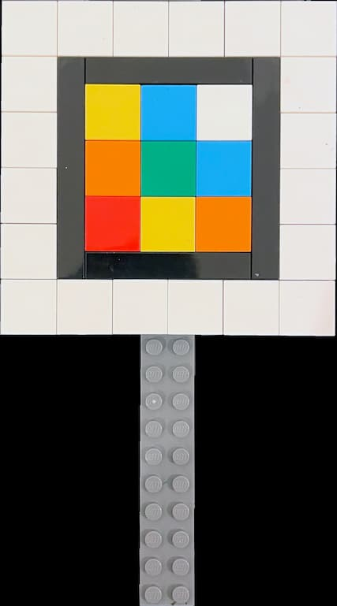

## ARTES - Augmented Reality Tiles for Environmental Sensing :diamond_shape_with_a_dot_inside: :seedling:


# About

:earth_africa: [https://ucl-casa-ce.github.io/artes](https://ucl-casa-ce.github.io/artes)

ARTES uses WebAR and physical markers to visualise real time data from MQTT feeds. It has been first developed during the [EAST SUMMER SCHOOL](https://www.queenelizabetholympicpark.co.uk/our-story/supporting-communities/education-and-young-people/east-education-summer-school), 26 July – 6 August 2021

__Discover how to build a simple soil sensor prototype to make sure your plants are getting the right amount of light and water, and design an AR (augmented reality) marker using mosaic tiles. In this hands-on creative tech space, you will learn how to make your marker come to life by making it interactive, pulling in data from the sensors, and accessing it via a smartphone. You will also have the opportunity to ask questions and find out more about the application of similar technologies in cutting-edge research projects by members of the Connected Environments Lab, such as the bat boxes in the Queen Elizabeth Olympic Park.__

# How it works

- [Build the ARTile](#build-the-artile)

- [Encode the tile](#encode-the-artile)

- [Visualise the data](#visualise-the-data)

## Build the ARTile

The same tips to create a [custom AR.js marker](https://medium.com/chialab-open-source/10-tips-to-enhance-your-ar-js-app-8b44c6faffca) applied to physical tiles. In our case we used Lego 2x2 flat tiles in 7 different colours:

- White
- Bright Red
- Bright Yellow
- Dark Green
- Bright Orange
- Medium Azur
- Earth Blue

The final marker uses a 3 by 3 tiles pattern (a 6 by 6 tiles pattern has been tested as well and it works just fine). The extra white tiles around the black frame are not essential but help in the detection of the marker.



## Encode the ARTile

Once the physical pattern is built, we need to translate it into a digital one. The `makerTiles/tiles.html` is a static (and very simple) page used to digitise and download an image of the tile made with the square tiles. The saved images need to be square, file format PNG (with no alpha channel or transparency) or JPG. 
To match the colour of the physical LEGO tiles with their digital version we used the following HEX code (Thanks [Christoph Bartneck](https://www.bartneck.de/2016/09/09/the-curious-case-of-lego-colors/) for the great article):

| Tile          |   HEX  |
|---------------|--------|
| White         | #FFFFFF |
| Bright Red    | #ED1D2A |
| Bright Yellow | #FFD500 |
| Dark Green    | #00843D |
| Bright Orange | #FF8200 |
| Medium Azur   | #1D83AF |
| Earth Blue    | #003865 |

During the event we run this page using [VSCode Live Server](https://marketplace.visualstudio.com/items?itemName=ritwickdey.LiveServer), and we used a touchscreen to easily select the tiles and the colours.

The folder _./markergen/node_ contains the scripts to create the pattern _.patt_ used by _AR.Js_. It is based on the [AR.js marker-training](https://github.com/AR-js-org/AR.js/tree/master/three.js/examples/marker-training), practically the same code, but we did not have access to a reliable internet connection during the event. Still, it can be used to batch convert mutiple images.
After installing the _node_modules_, using `npm install`, these are the steps to follow:

- copy the images to convert into Pattern file, and created by `makerTiles/tiles.html` mentioned above,  in the _./markergen/node/img_ folder (remember, images need to be square, PNG -no alpha channel, no transparency- or JPG);
- in a new `node.js` terminal, or in a new VSCode terminal, run the command `node generator` in the _./markergen/node/node_ folder ;

The patterns will be created and saved in the folder _./markergen/node/patt_;

> NOTE: if you need also the digital format of the marker (with the black border) you can use the [online tool](https://ar-js-org.github.io/AR.js/three.js/examples/marker-training/examples/generator.html), use a border ratio of 0.85 

## Visualise the data

The _patt files_ created with `markergen/node/generator.js` are used trigger the WebAR experience and need to be moved in the _resources/patt_ folder of the main website. We collected the real-time data from a series of sensors connected to Arduino boards and published to a MQTT broker (not covered here). We used [MQTT.js](https://github.com/mqttjs/MQTT.js) to subscribe to the public topics. All the WebAR logic is in the `markerManager.js` file while the 3D models of the plant and the screen are loaded from the `index.html` file. The markers are loaded using the `marker.json` file

```json
{
  "info": {
    "version": "1.0",
    "title": "WebAR-MultiMarkers",
    "markers": 2
  },
  "content": [
    {
      "markerName": "pattern-image1",
      "topic": "TOPIC/TO/SUBSCRIBE",
      "subtopics": [
        "temperature",
        "humidity",
        "moisture"
      ],
      "type": "",
      "textContent": "SAMPLE TEXT"
    },
    {
      "markerName": "pattern-image2",
      "topic": "TOPIC/TO/SUBSCRIBE",
      "subtopics": [
        "temperature",
        "humidity",
        "moisture"
      ],
      "type": "",
      "textContent": "SAMPLE TEXT"
    }
  ]
}

```

> NOTE: in order to make this project works, you will need to change some parameters in the `markerManager.js`: the MQTT address as websocket with its port (generally 8080), line 32; the topics to subscribe to, line 70-71-72.

As WebAR needs to access the camera of the smartphone a secure HTTPS connection is needed, therefore also the Websocket connection need to be secure (WSS). Easiest way is to use [GitHub Pages](https://pages.github.com/) or locally something like [npm package local-web-server](https://www.npmjs.com/package/local-web-server)


## Libraries

- [AFrame](https://aframe.io/)
- [AR.JS](https://github.com/AR-js-org/AR.js/)
- [MQTT.js](https://github.com/mqttjs/MQTT.js)

## Team

Martin de Jode (UCL - CASA - Connected Environments)

Leah Lovett (UCL - CASA - Connected Environments) @leahlovett

Valerio Signorelli (UCL - CASA - Connected Environments) @ValeSignorelli
